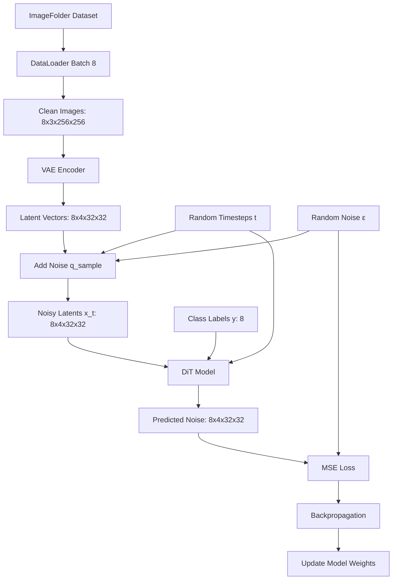
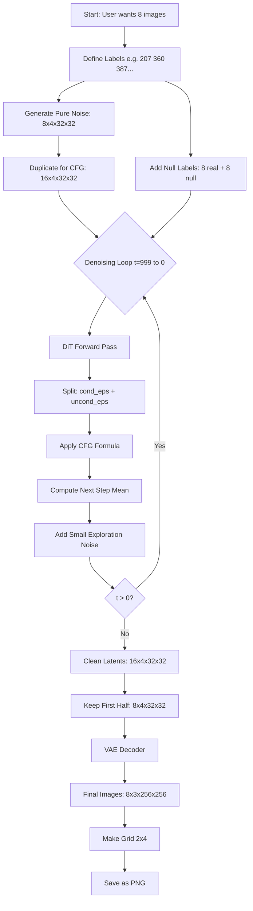

# DiT (Diffusion Transformer) - Educational Guide

> **A comprehensive guide to understanding how DiT generates images**  
> Designed for high school students and beginners in deep learning

---

## Table of Contents
- [Introduction](#introduction)
- [Core Concepts](#core-concepts)
- [Training Workflow](#training-workflow)
- [Inference Workflow](#inference-workflow)
- [Key Architecture Details](#key-architecture-details)
- [Concrete Examples](#concrete-examples)
- [Common Questions](#common-questions)
- [Summary Comparison](#summary-comparison)
- [Next Steps](#next-steps)

---

## Introduction

### What is DiT?

**DiT (Diffusion Transformer)** is a state-of-the-art AI model that can generate high-quality images from scratch. Think of it like teaching a computer to draw by showing it how to gradually turn random noise into beautiful pictures.

**Simple Analogy:** Imagine you have a blurry, noisy photo. DiT is like having a magical "enhance" button that gradually makes the photo clearer and clearer, one small step at a time, until you have a perfect, high-resolution image. But here's the cool part: DiT can also work backwards - it can start with pure noise (like TV static) and gradually turn it into any image you want, like a cat, dog, or bird!

### Why Does DiT Matter?

- **State-of-the-art quality:** DiT achieves some of the best results in image generation
- **Scalable:** Larger models produce better images (more is better!)
- **Flexible:** Can generate images of specific categories (conditional generation)
- **Educational:** Relatively simple architecture to understand

### The Big Picture

```
TRAINING: Learn how to remove noise
Clean Image → Add Noise → Model learns to predict the noise

INFERENCE: Generate new images
Random Noise → Remove Noise Step-by-Step → Clean Image
```

---

## Core Concepts

Before diving into how DiT works, let's understand the building blocks:

### 2.1 Images as Numbers

Computers see images as giant grids of numbers:

- **RGB Image:** 3 channels (Red, Green, Blue)
- **Dimensions:** [channels, height, width]
- **Example:** A 256×256 cat photo = `[3, 256, 256]` = **196,608 numbers**

```
Each pixel has 3 values:
[255, 128, 64] = Orange color
 ↑    ↑    ↑
Red  Green Blue
```

### 2.2 VAE (Variational AutoEncoder) - Image Compression

**Analogy:** VAE is like a ZIP compressor for images!

**Why do we need it?**
- Training on 256×256 images is **64× slower** than 32×32
- VAE compresses images to work in a smaller "latent space"
- Much faster training, same quality results

**How it works:**
```
Original Image:  [3, 256, 256] = 196,608 numbers
     ↓ VAE Encoder
Compressed:      [4, 32, 32]   = 4,096 numbers (48× smaller!)
     ↓ VAE Decoder
Reconstructed:   [3, 256, 256] = 196,608 numbers
```

**Important:** During encoding, a tiny bit of random noise is added (sampling from a Gaussian distribution). This is separate from the main diffusion noise!

### 2.3 Noise and Timesteps

**The Core Idea:** DiT learns to predict what noise was added to an image.

**Timesteps (t):** A number from 0 to 999
- `t=0`: Image is completely clean (no noise)
- `t=500`: Image is half noisy
- `t=999`: Image is pure random noise

**Noise Schedule:** Pre-calculated mixing recipe for each timestep
```
At timestep t=234:
alpha = 0.75  (keep 75% of clean image)
sigma = 0.66  (add 66% noise intensity)

Formula: noisy_image = 0.75 × clean_image + 0.66 × random_noise
```

**Concrete Example:**
```
Clean pixel value: 1.0
Random noise: 0.5

At t=234: 
mixed = (0.75 × 1.0) + (0.66 × 0.5)
      = 0.75 + 0.33
      = 1.08  ← This is what the model sees!
```

**Key Insight:** The noise schedule is **NOT learned**—it's pre-computed once and looked up during training/inference!

### 2.4 Patches (Puzzle Pieces)

Vision Transformers don't process entire images at once—they split them into small patches:

**Example:**
```
32×32 latent image with 2×2 patches:

┌─┬─┬─┬─┐
├─┼─┼─┼─┤  Each patch: 2×2 pixels × 4 channels = 16 values
├─┼─┼─┼─┤  Total patches: (32÷2) × (32÷2) = 16 × 16 = 256 patches
└─┴─┴─┴─┘

Each 16-value patch gets "embedded" → 384 dimensions
```

**Why patches?**
- Transformers work better with sequences
- Self-attention lets patches "talk" to each other
- More efficient than processing every pixel individually

### 2.5 Classifier-Free Guidance (CFG)

**CFG makes the model follow your instructions MORE strongly.**

**Formula:**
```
final_prediction = unconditional + scale × (conditional - unconditional)
```

**Analogy:** You ask an artist to draw a cat:
- Without CFG (scale=1.0): "Draw a cat" → Generic cat
- With CFG (scale=4.0): "Draw a SUPER cat with STRONG cat features!" → Detailed, high-quality cat
- Too much CFG (scale=10.0): "Draw an EXTREME cat!" → Oversaturated, unnatural

**How it works:**
1. Run model twice: once with label ("cat"), once without (null)
2. Find the difference: What makes it specifically a "cat" vs "anything"?
3. Amplify that difference by 4×
4. Result: Much stronger "cat-ness"

**Visual Comparison:**
```
CFG Scale:
1.0  → 🐱 (standard quality)
4.0  → 🐱✨ (high quality, default)
7.0  → 🐱💎 (very high quality)
10.0 → 🐱💥 (too strong, artifacts)
```

---

## Training Workflow

**Goal:** Teach the model to predict what noise was added to an image.

### Training Flow Diagram



### Step-by-Step Training Process

#### **Step 1: Load Images**
📍 **File:** [`train.py`](train.py) line 236

```python
# DataLoader loads a batch of images from dataset
x, y = next(train_loader)
# x: [8, 3, 256, 256] - 8 RGB images, 256×256 pixels
# y: [8] - Class labels, e.g., [5, 12, 7, 89, ...]
```

**Dataset Structure:**
```
/path/to/imagenet/train/
├── n01440764/  (class 0: tench fish)
│   ├── image001.jpg
│   ├── image002.jpg
├── n01443537/  (class 1: goldfish)
│   ├── image001.jpg
└── ...
```

**ImageFolder automatically:**
- Maps folder names to class indices (0, 1, 2, ...)
- Loads images and assigns labels
- No manual labeling needed!

#### **Step 2: VAE Encoding**
📍 **File:** [`train.py`](train.py) line 241

```python
with torch.no_grad():
    x = vae.encode(x).latent_dist.sample().mul_(0.18215)
# Input:  [8, 3, 256, 256] - RGB images
# Output: [8, 4, 32, 32]   - Compressed latents
```

**What happens inside VAE encoder:**
1. Convolutional layers compress 256×256 → 32×32
2. Output split into mean and log-variance
3. Sample from distribution: `latent = mean + std × tiny_noise`
4. Scale by 0.18215 (VAE-specific constant)

**Result:** 8× spatial compression, 48× fewer numbers to process!

#### **Step 3: Sample Random Timesteps**
📍 **File:** [`train.py`](train.py) line 243

```python
t = torch.randint(0, diffusion.num_timesteps, (x.shape[0],))
# Example: t = [234, 567, 12, 890, 345, 678, 123, 456]
```

**Why random?**
- Model sees all noise levels during training
- Each image in batch has different noise level
- Efficient: learn all timesteps simultaneously

#### **Step 4: Add Noise (Forward Diffusion)**
📍 **File:** [`diffusion/gaussian_diffusion.py`](diffusion/gaussian_diffusion.py) lines 228-229

```python
noise = torch.randn_like(x_start)  # Generate random Gaussian noise
x_t = q_sample(x_start, t, noise)   # Mix clean + noise

# Inside q_sample:
# x_t = sqrt(alpha_cumprod[t]) * x_start + sqrt(1 - alpha_cumprod[t]) * noise
```

**Concrete example with real numbers:**
```
Image 0 at t=234:
- Clean latent: [1.0, 0.8, -0.5, 0.3, ...]
- Random noise:  [0.9, -1.2, 0.3, -0.5, ...]
- alpha = 0.75 (from pre-computed schedule)
- sigma = 0.66

Noisy latent calculation:
x_t[0] = 0.75 × [1.0, 0.8, -0.5, 0.3] + 0.66 × [0.9, -1.2, 0.3, -0.5]
       = [0.75, 0.60, -0.375, 0.225] + [0.594, -0.792, 0.198, -0.33]
       = [1.344, -0.192, -0.177, -0.105]
```

#### **Step 5: DiT Model Prediction**
📍 **File:** [`models.py`](models.py) lines 233-248

```python
model_output = model(x_t, t, y)
# Input:  x_t: [8, 4, 32, 32], t: [8], y: [8]
# Output: [8, 4, 32, 32] - Predicted noise
```

**Inside the DiT model:**

1. **Patch Embedding** (line 240)
   ```python
   x = self.x_embedder(x) + self.pos_embed
   # [8, 4, 32, 32] → [8, 256, 384]
   # 256 patches, each embedded as 384-dim vector
   ```

2. **Encode Timestep** (line 241)
   ```python
   t = self.t_embedder(t)  # [8] → [8, 384]
   # Sinusoidal encoding: tells model "how noisy" the input is
   ```

3. **Encode Label** (line 242)
   ```python
   y = self.y_embedder(y, self.training)  # [8] → [8, 384]
   # Lookup embedding: tells model "what class" to generate
   # During training: 10% chance label → null token (1000)
   ```

4. **Combine Conditions** (line 243)
   ```python
   c = t + y  # [8, 384]
   # Fused condition: "Generate class Y at noise level T"
   ```

5. **Transformer Blocks** (lines 244-245)
   ```python
   for block in self.blocks:  # 12 layers for DiT-S
       x = block(x, c)
   # Each block uses c to modulate how it processes patches
   ```

6. **Output Projection** (line 246)
   ```python
   x = self.final_layer(x, c)
   # [8, 256, 384] → [8, 256, 16]
   ```

7. **Unpatchify** (line 247)
   ```python
   x = self.unpatchify(x)
   # [8, 256, 16] → [8, 4, 32, 32]
   # Reassemble patches into latent image
   ```

**Result:** Model predicts what noise was added!

#### **Step 6: Calculate Loss**
📍 **File:** [`diffusion/gaussian_diffusion.py`](diffusion/gaussian_diffusion.py) line 779

```python
loss = mean_squared_error(predicted_noise, actual_noise)
# Compare what model predicted vs what we actually added
```

**Example:**
```
Actual noise:     [0.9, -1.2, 0.3, -0.5]
Predicted noise:  [0.88, -1.15, 0.28, -0.48]

Differences:      [0.02, -0.05, 0.02, -0.02]
Squared:          [0.0004, 0.0025, 0.0004, 0.0004]
Mean:             0.000925

Lower loss = Better prediction!
```

#### **Step 7: Backpropagation**
📍 **File:** [`train.py`](train.py) line 250

```python
loss.backward()           # Compute gradients
optimizer.step()          # Update model weights
optimizer.zero_grad()     # Reset gradients
```

**The Learning Cycle:**
```
Bad prediction → High loss → Large gradient → Big weight update
Good prediction → Low loss → Small gradient → Small weight update
```

**Repeat this process for millions of iterations!**

### Key Training Detail: Label Dropout for CFG

📍 **File:** [`models.py`](models.py) lines 78-87

During training, 10% of labels are randomly replaced with a "null" token (class 1000):

```python
if torch.rand() < 0.1:
    label = 1000  # Null token
```

**Why?**
- Model learns conditional generation: "Generate a cat"
- Model learns unconditional generation: "Generate anything"
- Both are needed for Classifier-Free Guidance during inference

**Example batch:**
```
Original labels: [5, 3, 7, 1, 9, 2, 4, 6]
After dropout:   [5, 1000, 7, 1, 9, 1000, 4, 6]
                    ↑ dropped     ↑ dropped
```

---

## Inference Workflow

**Goal:** Generate new images from random noise.

### Inference Flow Diagram



### Step-by-Step Inference Process

#### **Step 1: Setup**
📍 **File:** [`sample.py`](sample.py) lines 46-58

```python
# Define what you want to generate
class_labels = [207, 360, 387, 974, 88, 979, 417, 279]
# 207 = Golden Retriever
# 360 = Otter
# 387 = Giant Panda
# ... etc

# Generate pure random noise
z = torch.randn(8, 4, 32, 32)

# Duplicate for CFG
z = torch.cat([z, z], 0)  # [16, 4, 32, 32]

# Create labels: real + null
y_null = torch.tensor([1000] * 8)
y = torch.cat([class_labels, y_null], 0)  # [16]
# First 8: [207, 360, 387, 974, 88, 979, 417, 279]
# Last 8:  [1000, 1000, 1000, 1000, 1000, 1000, 1000, 1000]
```

**Why duplicate?**
- To run conditional and unconditional predictions in parallel
- More efficient than running the model twice
- Enables Classifier-Free Guidance

#### **Step 2: Denoising Loop (t=999 → 0)**
📍 **File:** [`diffusion/gaussian_diffusion.py`](diffusion/gaussian_diffusion.py) p_sample_loop

```python
for t in range(999, -1, -1):  # 999, 998, 997, ..., 1, 0
    # Gradually remove noise, one step at a time
```

**Each step consists of:**

##### **Step 2a: Forward Pass with CFG**
📍 **File:** [`models.py`](models.py) lines 250-266

```python
def forward_with_cfg(x, t, y, cfg_scale):
    # x: [16, 4, 32, 32] - duplicated noisy images
    # y: [16] - [real_labels(8), null_labels(8)]
    
    # Take only first half, duplicate it
    half = x[:8]
    combined = torch.cat([half, half], 0)  # [16, 4, 32, 32]
    
    # Run model with different labels
    model_out = model(combined, t, y)
    # First 8:  predictions WITH labels (conditional)
    # Last 8:   predictions WITHOUT labels (unconditional)
    
    # Split results
    cond_eps = model_out[:8]    # [8, 4, 32, 32]
    uncond_eps = model_out[8:]  # [8, 4, 32, 32]
```

**Key insight:** Same noise, different labels → different predictions!

##### **Step 2b: Apply Classifier-Free Guidance**
📍 **File:** [`models.py`](models.py) line 264

```python
cfg_scale = 4.0  # Default value
final_eps = uncond_eps + cfg_scale * (cond_eps - uncond_eps)
```

**Breaking it down:**
```
For golden retriever at t=500:

uncond_eps[0, 0, 0, 0] = 0.5   # "Any object needs noise=0.5"
cond_eps[0, 0, 0, 0] = 0.8     # "Golden retriever needs noise=0.8"

Difference = 0.8 - 0.5 = 0.3   # This is "golden retriever-ness"
Amplified = 4.0 × 0.3 = 1.2    # Make it 4× stronger
Final = 0.5 + 1.2 = 1.7        # Result: STRONG golden retriever features
```

**Result:** 8 CFG-enhanced predictions (then duplicated to 16 for batch consistency)

##### **Step 2c: Calculate Next Step**
📍 **File:** [`diffusion/gaussian_diffusion.py`](diffusion/gaussian_diffusion.py) p_mean_variance

```python
# 1. Estimate what the clean image might be
pred_clean = (current_noisy - sigma_t * predicted_noise) / alpha_t

# 2. Calculate mean for next timestep (t-1)
# Don't jump directly to clean! Take small step.
next_mean = mix(current_noisy, pred_clean, coefficients)

# 3. Add tiny exploration noise (for diversity)
if t > 0:
    noise = torch.randn_like(current) * small_variance
    next_image = next_mean + noise
```

**Why gradual steps?**
```
Direct jump (unstable):
t=500: [noisy] → t=0: [clean] ✗ Big errors amplified!

Gradual steps (stable):
t=500: [noisy] → t=499: [slightly less noisy] → ... → t=0: [clean] ✓ Stable!
```

**Visual Progress:**
```
t=999: ▓▓▓▓▓▓▓▓  (100% noise)
t=750: ▓▓▓▓▓▒░░  (75% noise)
t=500: ▓▓▓▒▒░░░  (50% noise)
t=250: ▓▒▒░░░░░  (25% noise)
t=100: ▒░░░░░░░  (10% noise)
t=0:   ░░░░░░░░  (0% noise - clean image!)
```

#### **Step 3: Remove Duplicate**
📍 **File:** [`sample.py`](sample.py) line 64

```python
samples, _ = samples.chunk(2, dim=0)
# Keep: [8, 4, 32, 32] - The 8 CFG-enhanced images
# Discard: [8, 4, 32, 32] - Duplicate (not needed anymore)
```

**Why were they duplicated?**
- To maintain batch size consistency during denoising loop
- forward_with_cfg expects [16, ...] and returns [16, ...]
- But we only need 8 unique results

#### **Step 4: VAE Decoding**
📍 **File:** [`sample.py`](sample.py) line 65

```python
samples = vae.decode(samples / 0.18215).sample
# Input:  [8, 4, 32, 32]   - Compressed latents
# Output: [8, 3, 256, 256] - Full RGB images
```

**VAE decoder:**
- Upscales 32×32 → 256×256 (8× larger)
- Converts 4 latent channels → 3 RGB channels
- Applies learned deconvolution layers
- Smooths any patch boundaries

#### **Step 5: Save Images**
📍 **File:** [`sample.py`](sample.py) line 68

```python
save_image(samples, "sample.png", nrow=4, 
           normalize=True, value_range=(-1, 1))
```

**Processing steps:**
1. **Arrange in grid:** 8 images → 2 rows × 4 columns
2. **Normalize:** [-1, 1] → [0, 1]
3. **Scale:** [0, 1] → [0, 255] (uint8)
4. **Add padding:** 2 pixels between images
5. **Save:** Single PNG file containing all images

**Final grid layout:**
```
┌────────┬────────┬────────┬────────┐
│ Img 0  │ Img 1  │ Img 2  │ Img 3  │  Row 1
│ 256x256│ 256x256│ 256x256│ 256x256│
├────────┼────────┼────────┼────────┤
│ Img 4  │ Img 5  │ Img 6  │ Img 7  │  Row 2
│ 256x256│ 256x256│ 256x256│ 256x256│
└────────┴────────┴────────┴────────┘

Output: sample.png (1034 × 518 pixels)
```

---

## Key Architecture Details

### 5.1 DiT Block (Transformer Layer)

📍 **File:** [`models.py`](models.py) lines 101-122

Each DiT block has two main components:

#### **Adaptive Layer Normalization (AdaLN)**

```python
# Condition c generates 6 parameters
shift_msa, scale_msa, gate_msa, shift_mlp, scale_mlp, gate_mlp = \
    adaLN_modulation(c).chunk(6, dim=1)
```

**What each parameter does:**

| Parameter | Purpose | Effect |
|-----------|---------|--------|
| **shift_msa** | Shift before attention | Adjusts feature distribution |
| **scale_msa** | Scale before attention | Amplifies/reduces features |
| **gate_msa** | Gate attention output | Controls how much attention to use |
| **shift_mlp** | Shift before MLP | Adjusts feature distribution |
| **scale_mlp** | Scale before MLP | Amplifies/reduces features |
| **gate_mlp** | Gate MLP output | Controls how much MLP to use |

**Example:**
```python
# At t=234, label=cat:
shift_msa = [0.1, -0.2, 0.3, ...]  # Specific shift for "cat at t=234"
scale_msa = [1.2, 0.8, 1.5, ...]   # Specific scale for "cat at t=234"
gate_msa = [0.9, 0.7, 0.95, ...]   # High gate values (use attention)

# At t=999, label=null:
shift_msa = [-0.3, 0.5, -0.1, ...]  # Different shift
scale_msa = [0.8, 1.1, 0.9, ...]    # Different scale
gate_msa = [0.3, 0.4, 0.2, ...]     # Low gate values (less attention)
```

#### **Self-Attention**

```python
x = x + gate_msa * attn(modulate(norm(x), shift_msa, scale_msa))
```

**What happens:**
1. Normalize features
2. Modulate with condition-specific shift/scale
3. Apply multi-head self-attention (patches communicate)
4. Gate the output (condition controls strength)
5. Add residual connection

**Intuition:** Different timesteps/labels → different attention patterns!

#### **Feed-Forward MLP**

```python
x = x + gate_mlp * mlp(modulate(norm(x), shift_mlp, scale_mlp))
```

**Structure:**
```
Input (384 dim) 
  ↓ Linear
Hidden (1536 dim) - 4× expansion
  ↓ GELU activation
Output (384 dim)
  ↓ Linear
Back to (384 dim)
```

### 5.2 Unpatchify (Reassembly)

📍 **File:** [`models.py`](models.py) lines 218-231

**Challenge:** Convert 256 patches back to 32×32 image

**Solution:**
```python
def unpatchify(self, x):
    # Input: [batch, 256, 16]
    # 256 patches, each with 16 values (2×2×4)
    
    # Step 1: Reshape to grid structure
    x = x.reshape(batch, 16, 16, 2, 2, 4)
    # [batch, grid_h, grid_w, patch_h, patch_w, channels]
    
    # Step 2: Rearrange dimensions
    x = torch.einsum('nhwpqc->nchpwq', x)
    # Interleaves grid and patch dimensions
    
    # Step 3: Flatten to final image
    x = x.reshape(batch, 4, 32, 32)
    # [batch, channels, height, width]
    
    return x
```

**Visual:**
```
256 patches in memory:
[P0, P1, P2, ..., P255]

After reshape + einsum:
┌──┬──┬──┬──┐
│P0│P1│P2│P3│
├──┼──┼──┼──┤
│P4│P5│P6│P7│  Spatially arranged!
├──┼──┼──┼──┤
...

Each patch's pixels are placed in correct location
No gaps, seamless reassembly!
```

### 5.3 Noise Schedule

📍 **File:** [`diffusion/gaussian_diffusion.py`](diffusion/gaussian_diffusion.py) lines 165-185

**Pre-computed during initialization:**

```python
# Linear schedule from 0.0001 to 0.02
betas = np.linspace(0.0001, 0.02, 1000)

# Calculate alphas
alphas = 1.0 - betas

# Cumulative product
alphas_cumprod = np.cumprod(alphas)

# Pre-compute square roots (for efficiency)
sqrt_alphas_cumprod = np.sqrt(alphas_cumprod)
sqrt_one_minus_alphas_cumprod = np.sqrt(1.0 - alphas_cumprod)
```

**Example values:**
```
t=0:    alpha_cumprod ≈ 1.0     (100% clean signal)
t=100:  alpha_cumprod ≈ 0.98    (98% clean)
t=234:  alpha_cumprod ≈ 0.57    (57% clean)
t=500:  alpha_cumprod ≈ 0.16    (16% clean)
t=999:  alpha_cumprod ≈ 0.0001  (0.01% clean)
```

**Key point:** These values are **NOT learned**—they're a fixed mathematical schedule!

---

## Concrete Examples

### Training Example (Single Image)

```
📸 Input Image: Cat photo
🏷️ Label: 5 (cat class in dataset)
🎲 Sampled Timestep: 234

Step 1: Load & VAE Encode
  RGB image: [3, 256, 256]
  → Compress: [4, 32, 32]

Step 2: Generate Noise
  Random noise: [4, 32, 32]
  Example values at position [0,0,0,0]: 0.92

Step 3: Mix Clean + Noise
  At t=234: alpha=0.75, sigma=0.66
  Clean value: 1.0
  Noisy value: 0.75 × 1.0 + 0.66 × 0.92 = 1.36

Step 4: DiT Prediction
  Input: Noisy [1, 4, 32, 32], t=[234], y=[5]
  → Split into patches: [1, 256, 384]
  → Transformer processing with condition
  → Output: Predicted noise [1, 4, 32, 32]
  Predicted value at [0,0,0,0]: 0.89

Step 5: Calculate Loss
  Actual noise: 0.92
  Predicted: 0.89
  Error: (0.92 - 0.89)² = 0.0009
  → Low error = Good prediction!

Step 6: Backprop & Update
  Compute gradients, update weights
  Model gets slightly better at predicting noise
```

### Inference Example (Generate New Image)

```
🎯 Goal: Generate golden retriever (label 207)
⚙️ CFG Scale: 4.0

t=999 (Start):
  Pure random noise: [0.92, -1.3, 0.5, 0.78, ...]
  → Model sees: complete chaos
  → Predicts: "Remove this much noise: [...]"
  → CFG amplifies golden retriever features
  → After step: [0.87, -1.25, 0.48, 0.75, ...]

t=750:
  Still very noisy, but slight structure emerging
  → Model: "I see some rough shapes"
  → Continue removing noise...

t=500:
  Medium noise, dog shape becoming visible
  → Model: "This is definitely a dog"
  → CFG: "Make it MORE golden retriever-like"

t=250:
  Low noise, golden retriever features clear
  → Model: "Golden fur, friendly face"
  → CFG: "Enhance those features!"

t=100:
  Almost clean, fine details appearing
  → Model: "Refining textures and colors"

t=0 (Final):
  Clean latent: [1.0, 0.8, -0.5, 0.3, ...]
  → VAE decode: [3, 256, 256]
  → Beautiful golden retriever image! 🐕
```

### CFG Comparison (Same Seed, Different Scales)

```
Label: Cat (class 5)
Seed: 42 (same random noise)

CFG Scale = 1.0:
  Result: Generic cat, average quality
  Diversity: High
  Prompt adherence: Standard

CFG Scale = 4.0 (Default):
  Result: Detailed cat with strong features
  Diversity: Medium
  Prompt adherence: High
  ✓ Best balance!

CFG Scale = 7.0:
  Result: Very detailed cat, saturated colors
  Diversity: Low
  Prompt adherence: Very high

CFG Scale = 10.0:
  Result: Oversaturated, unnatural artifacts
  Diversity: Very low
  Prompt adherence: Too high (overfitting)
  ✗ Too strong!
```

---

## Common Questions

### Q1: Why does the model predict noise instead of the clean image?

**Answer:** Predicting noise is more stable and easier to learn!

**Analogy:** It's easier to identify "what doesn't belong" than to guess "what should be there."

**Mathematical reason:**
- Noise has a known distribution (Gaussian: mean=0, std=1)
- Clean images have complex, unknown distributions
- Model learns: "Remove anything that looks like random noise"

### Q2: Why 1000 timesteps? Why not just 10?

**Answer:** Small gradual steps are much more stable than big jumps.

**Analogy:**
- Walking down stairs: 1000 small steps ✓ Safe
- Jumping from top to bottom: 10 big jumps ✗ Dangerous

**Mathematical reason:**
- Large steps amplify prediction errors
- Small steps keep errors under control
- Like numerical integration in calculus!

**Trade-off:**
- More steps = Higher quality, but slower
- Fewer steps = Faster, but lower quality
- DiT can use 250 steps (faster) with minimal quality loss

### Q3: What happens if I use wrong timestep?

**Answer:** The model will give incorrect predictions!

**Example:**
```
Real situation: t=234 (medium noise)
If you tell model t=100 (low noise):
  → Model thinks image is cleaner than it is
  → Predicts too little noise to remove
  → Denoising fails!

If you tell model t=800 (high noise):
  → Model thinks image is noisier than it is
  → Predicts too much noise to remove
  → Output becomes more noisy!
```

The timestep embedding is crucial for correct prediction!

### Q4: Why does VAE add random noise during encoding?

**Answer:** VAE is a probabilistic model, not deterministic.

**Two types of noise:**
1. **VAE encoding noise:** Tiny randomness in latent space
   - Purpose: Make VAE learn smooth latent space
   - Amount: Very small (controlled by learned variance)
   - When: During encoding only

2. **Diffusion noise:** Main noise for training
   - Purpose: Train model to remove noise
   - Amount: Large, varies with timestep
   - When: Added explicitly during training

**Important:** These are separate! VAE noise ≈ 0.01, Diffusion noise ≈ 0.5-1.0

### Q5: Can patches cause visible grid artifacts?

**Answer:** Rarely, and mitigations help!

**Potential issue:**
```
Patch boundaries might create discontinuities:
┌─────┬─────┐
│  A  │  B  │  If A and B don't align perfectly,
├─────┼─────┤  you might see a vertical line
│  C  │  D  │
└─────┴─────┘
```

**Why it's usually not a problem:**
1. **Self-attention:** Patches communicate, coordinate boundaries
2. **VAE decoder:** Convolutional layers naturally smooth
3. **Good training:** Model learns to produce coherent outputs
4. **Latent space:** Working at 32×32, so patches are large in pixel space

**In practice:** DiT generates high-quality images with minimal artifacts!

### Q6: How long does training take?

**Answer:** Depends on hardware and model size.

**Example (DiT-XL/2, ImageNet 256×256):**
- Hardware: 8× NVIDIA A100 GPUs
- Steps: 400,000 iterations
- Time: ~2-3 weeks
- Cost: Expensive! ($10,000+)

**For learning (DiT-S/2, Tiny ImageNet):**
- Hardware: 1× RTX 3090/4090
- Steps: 10,000 iterations
- Time: Few hours
- Cost: Affordable for experiments

### Q7: What's the difference between DiT and Stable Diffusion?

**Comparison:**

| Aspect | DiT | Stable Diffusion |
|--------|-----|------------------|
| Backbone | Transformer | U-Net |
| Conditioning | Class labels | Text (CLIP) |
| Input patches | Yes | No (full latent) |
| Scalability | Excellent | Good |
| Text-to-image | No | Yes |
| Class-conditional | Yes | Limited |

**DiT advantages:**
- Better scalability (larger model = better results)
- Simpler architecture
- State-of-the-art on class-conditional tasks

**Stable Diffusion advantages:**
- Text prompts (more flexible)
- Pre-trained on diverse data
- Widely used for creative applications

---

## Summary Comparison

### Training vs Inference

| Aspect | Training | Inference |
|--------|----------|-----------|
| **Input** | Clean images from dataset | Pure random noise |
| **Goal** | Learn to predict noise | Generate clean images |
| **Direction** | Forward (add noise) + Learn | Reverse (remove noise) |
| **Timesteps** | Random sampling (0-999) | Sequential (999→0) |
| **Labels** | Real labels (90%) + null (10%) | Real labels + null for CFG |
| **Model runs** | Once per step | Twice per step (cond + uncond) |
| **Output** | Loss value → Update weights | Generated images |
| **Duration** | Millions of iterations, weeks | 250-1000 steps, seconds |
| **GPU memory** | Stores gradients (high) | No gradients (lower) |
| **Batch size** | Typically 8-256 | Typically 1-64 |

### Data Flow Comparison

**Training:**
```
Dataset → Load → VAE Encode → Add Noise → DiT → Predict Noise
                                               ↓
                                            Compare
                                               ↓
                                          Calculate Loss
                                               ↓
                                           Backprop
                                               ↓
                                        Update Weights
```

**Inference:**
```
Random Noise → DiT (with CFG) → Predict Noise → Remove Noise
                      ↓
                 Repeat 1000×
                      ↓
               Clean Latent → VAE Decode → RGB Image → Save
```

### Key Equations

**Training (Forward Diffusion):**
```
x_t = sqrt(α̅_t) × x_0 + sqrt(1 - α̅_t) × ε

Where:
- x_0: clean image
- x_t: noisy image at timestep t
- α̅_t: pre-computed alpha_cumprod[t]
- ε: random Gaussian noise

Loss = MSE(ε, ε_predicted)
```

**Inference (Reverse Diffusion):**
```
x_{t-1} = μ_t + σ_t × z

Where:
- μ_t: mean for next step (computed from x_t and predicted noise)
- σ_t: small variance for exploration
- z: tiny random noise

With CFG:
ε_final = ε_uncond + s × (ε_cond - ε_uncond)
Where s = cfg_scale (typically 4.0)
```

---

## Try It Yourself!

### Generate Your First Images

```bash
# 1. Setup environment
cd /path/to/DiT
conda activate DiT  # or your environment

# 2. Run with default settings
python sample.py

# 3. Try different CFG scales
python sample.py --cfg-scale 1.0   # Low guidance
python sample.py --cfg-scale 4.0   # Default
python sample.py --cfg-scale 7.0   # High guidance

# 4. Generate more images
python sample.py --seed 42         # Reproducible results
python sample.py --seed 123        # Different results

# 5. Use 512×512 model (slower, higher quality)
python sample.py --image-size 512
```

### Start Training (Educational)

```bash
# 1. Download Tiny ImageNet (smaller dataset)
wget http://cs231n.stanford.edu/tiny-imagenet-200.zip
unzip tiny-imagenet-200.zip

# 2. Train on single GPU
python train.py --single-gpu \
                --model DiT-S/2 \
                --data-path tiny-imagenet-200/train \
                --global-batch-size 8 \
                --num-classes 200

# 3. Monitor training
# Check terminal output for loss values
# Lower loss = Better learning!

# 4. Generate from your checkpoint
python sample.py --ckpt /path/to/your/checkpoint.pt \
                 --model DiT-S/2 \
                 --num-classes 200
```

---

## Next Steps

### For Learners:
1. ✅ Read this guide completely
2. 📊 Run inference with different settings
3. 🧪 Try training on Tiny ImageNet
4. 📖 Read the [official paper](http://arxiv.org/abs/2212.09748)
5. 🔍 Explore the code with debugging breakpoints
6. 💡 Experiment with modifications

### For Developers:
1. 📘 Read the [official README](README.md)
2. 🏋️ Train on full ImageNet dataset
3. 🔧 Implement improvements (Flash Attention, mixed precision)
4. 🎯 Fine-tune on custom datasets
5. 🚀 Deploy for applications

### Resources:
- **Paper:** [Scalable Diffusion Models with Transformers](http://arxiv.org/abs/2212.09748)
- **Project Page:** [https://www.wpeebles.com/DiT](https://www.wpeebles.com/DiT)
- **Hugging Face Demo:** [Try DiT online](https://huggingface.co/spaces/wpeebles/DiT)
- **GitHub:** [facebookresearch/DiT](https://github.com/facebookresearch/DiT)

### Related Topics to Explore:
- **Vision Transformers (ViT):** How transformers work for images
- **DDPM:** Original diffusion model paper
- **Latent Diffusion Models:** Stable Diffusion's foundation
- **Classifier-Free Guidance:** Original paper by Ho & Salimans
- **Score-based Models:** Alternative view of diffusion

---

## Acknowledgments

This educational guide is based on the DiT implementation by William Peebles and Saining Xie (UC Berkeley, NYU).

**Original DiT Paper:**
```bibtex
@article{Peebles2022DiT,
  title={Scalable Diffusion Models with Transformers},
  author={William Peebles and Saining Xie},
  year={2022},
  journal={arXiv preprint arXiv:2212.09748},
}
```

**Created for educational purposes** to help high school students and beginners understand diffusion models and transformers for image generation.

---

## Glossary

- **Batch:** Multiple images processed together
- **CFG:** Classifier-Free Guidance - technique to strengthen conditioning
- **Diffusion:** Gradual process of adding or removing noise
- **Embedding:** Converting discrete values (labels, timesteps) to continuous vectors
- **Latent Space:** Compressed representation learned by VAE
- **MSE:** Mean Squared Error - measures prediction accuracy
- **Patch:** Small square region of an image
- **Timestep:** Index indicating noise level (0=clean, 999=noisy)
- **Transformer:** Neural network architecture using self-attention
- **VAE:** Variational AutoEncoder - learns to compress/decompress images

---

**Happy Learning! 🚀**

*If you have questions or find errors, please open an issue on GitHub.*
